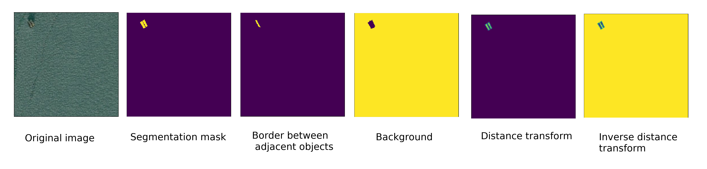
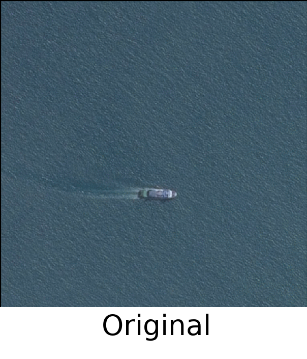
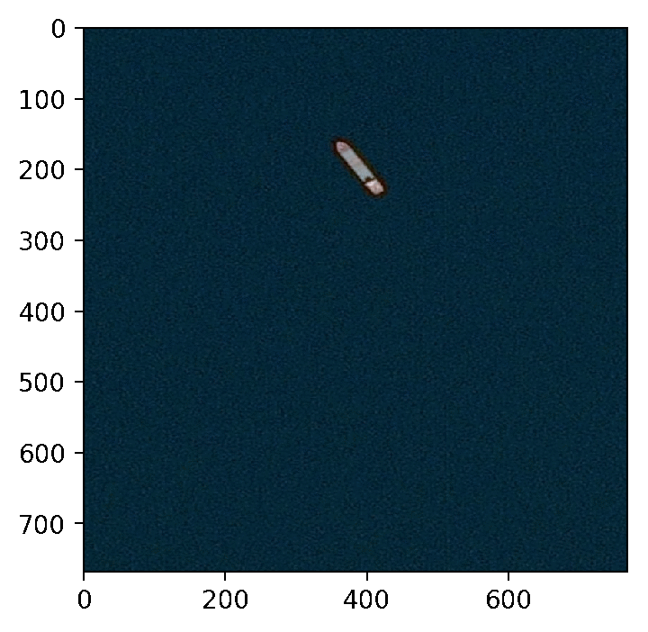

# Universal segmentation baseline. Kaggle Airbus Ship Detection Challenge - bronze medal solution. 

This repository contains a complete solution for the challenge: from creating datasets to training and creating a submit file. Moreover, it can be used as a universal high-quality baseline solution for any segmentation task.


## Content

*  [Quick setup and start](#quickstart)
*  [Targets for segmentation](#targets)
*  [Augmentations](#augmentations)
*  [Training](#training)
*  [Prediction and postprocessing](#prediction)

## Quick setup and start  <a name="quickstart"/>

### Preparations 

* Clone the repo, build a docker image using provided script and Dockerfile

    ```
    git clone 
    cd airbus-ship-detection/docker
    ./build.sh
    ```
* The final folder structure should be:
  
    ```
    airbus-ship-detection
    ├── data
    ├── docker
    ├── git_images
    ├── notebooks
    ├── src
    ├── README.md
    ```

### Run

* The container could be started by a shell script

    ```
    cd airbus-ship-detection/docker
    ./run.sh
    ```

## Targets for segmentation  <a name="targets"/>

Using src/target.py one could create several different targets for training besides usual masks to enhance resulting quality. All types of targets presented on the following image.



Therefore one can use:
 1) **mask** as the main target
 2) **border** to learn to separate adjacent objects
 3) **background** as an auxiliary class for training
 4) **distance transform** to learn to find objects centers
 5) **inverse distance transform** as an auxiliary class to find objects centers
 
 Using this repo there is no need to create and store this targets separately (except usual masks), they will be generated on the fly by passing masks for instance segmentation to the transforms.
 Mask for instance segmentation here is the mask where background is 0 and every object is encoded by one number starting from 1 to 255 thus limiting maximum number of objects on one image by 255).
 
 For the challenge all ships masks were encoded using rle in one csv file. Process of creating masks for instance segmentation is presented in [make_targets.ipynb](notebooks/make_targets.ipynb).
 
 ## Augmentations for training  <a name="augmentations"/>
 
 Here several essential augmentations in [transforms.py](src/transforms.py) which can be seen on the following image.
 


All transforms are applied on the fly during batch preparation and there is no need to store something besides original images.

 ## Training  <a name="training"/>
 
 Training process is implemented in [train_linknet.ipynb](/notebooks/train_linknet.ipynb) notebook.
 Here we use [Argus](https://github.com/lRomul/argus) framework for PyTorch which makes this process easier and more compact.
 For training you only need to pass model and loss function and follow procedure described in the [example](https://github.com/lRomul/argus#examples).
 
 As a model we used U-Net with ResNet34 as encoder but you can set any available ResNet(18,34,50,101,152) and choose whether to use pretrained layers from torchvision or not.
 The full architecture may be found in [src/models/unet_flex.py](src/models/unet_flex.py).
 
 In case you would like to train ensemble of models and you split dataset into folds you can use [src/train.py](src/train.py) script.
 Besides paths to images, targets and directory to save model (as for usual training) in this case you should provide path to the dictionary with image names (without extentions) as keys and fold indexes as values.
 
 Model for the competition may be found [here](https://my.pcloud.com/publink/show?code=XZSoBO7ZwU4RhgBeioXUW1aLJxFDamFfna3y)
 It was trained on all non-empty train images splitted in 5 batches for 150 epochs with starting lr=1e-4.
 
 ## Prediction  and postprocessing <a name="prediction"/>
 
 This part of the repo is relevant only for the competition but some postprocessing functions may be used to treat any segmentation results.
 The whole process described in [noteboks/prediction.ipynb](notebooks/prediction.ipynb). There is function "waters" which combines all used postprocessing techniques: removing of false positive predictions (with area less then threshold), boundaries separation and fitting every ship by a rectangle.
 Examples of trained model predictions and results of postprocessing are presented on the following image.
 
 
 
 
 
